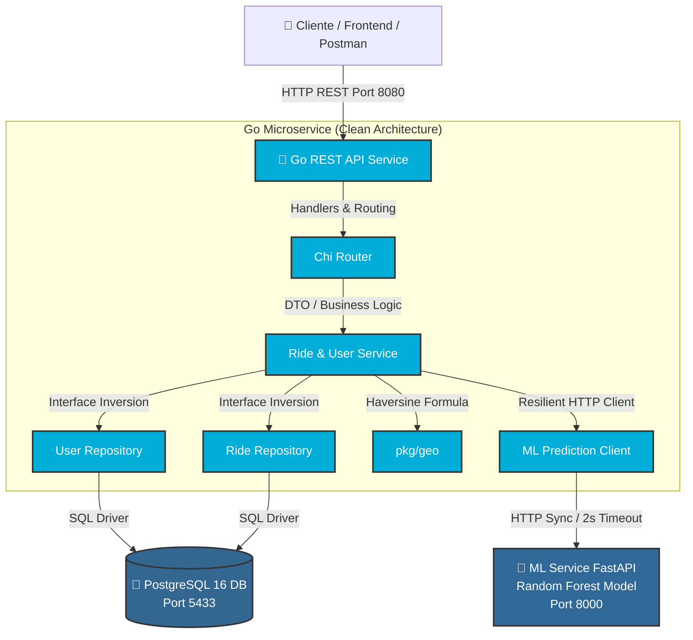

# 🚖 Routeforge — Urban Mobility & Dynamic Pricing Simulation API

> Sistema de microsserviços para simulação de corridas de aplicativo em tempo real, com cálculo de rota/distância, estimativa preditiva de preço dinâmico (*Surge Pricing*) e ETA via Machine Learning, com arquitetura resiliente e *Fallback Pattern* em Go e Python.

---

## 📌 Visão Geral do Projeto

O **Routeforge** é um projeto de portfólio backend focado no domínio de mobilidade urbana e delivery (inspirado em plataformas como Uber, 99 e iFood). O objetivo principal é demonstrar a construção de uma arquitetura de microsserviços resiliente, aplicando **SOLID**, **Clean Architecture** e estratégias de **Alta Disponibilidade (Graceful Degradation)** na linguagem **Go**, com suporte a predições de **Machine Learning (Python/FastAPI)** e persistência relacional **PostgreSQL**.

### 🌟 Destaques Arquiteturais
- **Serviço Principal em Go**: API REST desenvolvida com `go-chi`, injeção de dependências por interface e separação rigorosa em camadas (*Handler*, *Service*, *Repository*, *Client*).
- **Microsserviço de Predição (FastAPI / Python)**: Modelo `RandomForestRegressor` treinado com 2.500 amostras sintéticas para estimar o tempo de chegada (ETA) e o multiplicador de preço dinâmico (*Surge Pricing*) com base na distância e momento temporal.
- **Indexação Geográfica em Tempo Real & Caching (Redis 7)**:
  - **Redis GEOADD & GEOSEARCH**: Armazenamento e consulta espacial ultra-rápida (sub-milissegundo) de motoristas mais próximos por raio de distância (`POST /api/v1/drivers/location` e `GET /api/v1/drivers/nearby`).
  - **Route Estimate Caching (TTL 3 min)**: Caching inteligente de estimativas de preços/rotas no Redis. A 1ª consulta executa a predição no ML (*Cache MISS*), enquanto as consultas subsequentes para a mesma rota retornam instantaneamente do Redis (*Cache HIT - `cached: true`*).
- **Segurança & Autenticação Stateless (JWT + RBAC)**:
  - Autenticação via `POST /api/v1/auth/login` gerando tokens JWT (`golang-jwt/jwt/v5`).
  - Middlewares de autorização granular por perfil: apenas passageiros (`passenger`) podem solicitar corridas e apenas motoristas (`driver`) podem aceitar corridas, retornando `401 Unauthorized` ou `403 Forbidden` quando não autorizado.
- **Proteção contra Scrapping e DDoS (Rate Limiting)**:
  - Rate Limiter por IP em memória (`golang.org/x/time/rate`) no endpoint `/api/v1/rides/estimate`, permitindo até 10 requisições por minuto por IP e respondendo com `429 Too Many Requests` em requisições excedentes.
- **Resiliência & Alta Disponibilidade (*Fallback Pattern*)**: Cliente HTTP em Go com `timeout` de 2s e mecanismo de **contingência automática**. Se o microsserviço de ML falhar ou estiver indisponível, a API em Go assume uma precificação padrão sem interromper a experiência do usuário.
- **Documentação Interativa (Swagger / OpenAPI)**:
  - 🚀 **Go API Swagger UI**: [http://localhost:8080/swagger/index.html](http://localhost:8080/swagger/index.html)
  - 🤖 **FastAPI ML OpenAPI**: [http://localhost:8000/docs](http://localhost:8000/docs)
- **Persistência Relacional**: Banco de dados PostgreSQL 16 com esquemas normalizados (`users`, `rides`, `price_history`) e migrações SQL versionadas.
- **Infraestrutura Otimizada**: Orquestração via Docker e Docker Compose com compilação multi-stage em Go (`golang:1.23-alpine` -> `alpine:latest`).

---

## 🏗️ Arquitetura do Sistema



---

## 🧠 Princípios SOLID Aplicados em Go

| Princípio | Aplicação Prática no Projeto |
| :--- | :--- |
| **S - Single Responsibility** | Separação estrita de responsabilidades: `UserHandler` cuida da serialização HTTP, `RideService` executa regras de negócio, `haversine.go` calcula distâncias e `user_repository.go` cuida do SQL. |
| **O - Open/Closed** | A camada de serviço consome a abstração `PredictionClient`. Para alterar a integração de ML ou adicionar um novo provedor de precificação, basta passar uma nova implementação sem modificar a regra de negócio. |
| **L - Liskov Substitution** | Os repositórios concretos do PostgreSQL (`userRepository`, `rideRepository`) satisfazem 100% dos contratos das interfaces de domínio sem efeitos colaterais. |
| **I - Interface Segregation** | Interfaces enxutas e focadas (`UserRepository`, `RideRepository`, `PredictionClient`) em vez de uma interface gigante monolítica. |
| **D - Dependency Inversion** | Os serviços e handlers em Go dependem de abstrações (interfaces), injetadas via construtores fábrica (`NewRideService`, `NewRideHandler`). |

---

## ⚡ Resiliência & Fallback Pattern (Alta Disponibilidade)

Em ecossistemas de alta escala, microsserviços de IA/ML podem falhar por timeout, sobrecarga ou problemas de rede. O **Routeforge** garante resiliência através do **Fallback Pattern**:

```
[Requisição de Corrida] ──> [Go API] ──> [ML Service (Timeout: 2s)]
                                              │
                                     ┌────────┴────────┐
                                     │                 │
                               (Sucesso HTTP 200)  (Timeout / Falha HTTP 5xx / Queda)
                                     │                 │
                                     v                 v
                           [Preço Dinâmico ML]   [Cálculo de Contingência (Fallback)]
                           surge: 1.0 - 2.5       surge: 1.0 (Tarifa Base + R$1.80/km)
                           is_fallback: false     is_fallback: true
```

---

## 🛠️ Tecnologias Utilizadas

- **Go (Golang 1.23)**: `go-chi/chi/v5` (Router), `database/sql` + `lib/pq`, `google/uuid`, `stretchr/testify` (Mocks e Assertions).
- **Python 3.11**: `FastAPI`, `Uvicorn`, `scikit-learn`, `pandas`, `pytest`.
- **Banco de Dados**: `PostgreSQL 16` com scripts SQL nativos versionados.
- **DevOps**: `Docker`, `Docker Compose`, Multi-stage builds.

---

## 📜 Requisitos do Sistema

Para entender em detalhes todos os Requisitos Funcionais (RF), Requisitos Não-Funcionais (RNF) e Regras de Negócio (RN), consulte o documento de engenharia de requisitos:

👉 **[Especificação Completa de Requisitos (docs/requirements.md)](docs/requirements.md)**

---

## 🗺️ Roadmap de Desenvolvimento

- [x] **Etapa 1: Estrutura do Projeto & Infraestrutura Inicial**
  - Especificação detalhada de Requisitos (`docs/requirements.md`).
  - Modelagem do banco de dados relacional e migrações SQL (`db/migrations/`).
  - Orquestração inicial via Docker Compose com PostgreSQL.
- [x] **Etapa 2: Microsserviço de Predição de Tarifa & ETA (FastAPI)**
  - Script de geração de dados sintéticos (2.500 amostras) e treino do modelo `RandomForestRegressor`.
  - Endpoints REST `/health` e `/predict` validados com Pydantic V2.
  - Testes unitários com `pytest` (100% aprovados) e `Dockerfile` executável.
- [x] **Etapa 3: Serviço Go — Camada de Domínio & Repositórios (SOLID)**
  - Entidades de domínio (`User`, `Ride`, `PriceHistory`) e abstrações por interface.
  - Implementação concreta dos repositórios PostgreSQL (`userRepository` e `rideRepository`) com `database/sql` e pool de conexões.
- [x] **Etapa 4: Serviço Go — Regras de Negócio & Resiliência (Fallback)**
  - Cálculo de distância geodésica via Fórmula de Haversine (`pkg/geo/haversine.go`).
  - Cliente HTTP síncrono com timeout de 2s (`client/ml_client.go`).
  - Lógica de negócios `RideService` com acionamento do **Fallback Pattern** em indisponibilidades de ML.
  - Cobertura por testes unitários com mocks (`stretchr/testify`) 100% aprovados.
- [x] **Etapa 5: Serviço Go — Handlers HTTP & Rotas (`go-chi`)**
  - Endpoints REST para cadastro de usuários (`/api/v1/users`), estimativa (`/estimate`), solicitação (`/rides`), aceite (`/accept`), conclusão (`/complete`) e auditoria (`/rides/{id}`).
  - Roteamento com `go-chi/chi/v5`, middlewares de log/recovery e testes com `httptest`.
- [x] **Etapa 6: Conteinerização Multi-stage & Integração End-to-End**
  - `Dockerfile` multi-stage otimizado para a API em Go.
  - Orquestração dos 3 microsserviços via Docker Compose.
  - Validação E2E do ciclo de vida da corrida e testes de resiliência em tempo real simulando queda do microsserviço de ML (Fallback Pattern comprovado).
- [x] **Etapa 7: Documentação Final & Guia de Produção**
  - Guia executivo completo, especificação OpenAPI/CURL e roadmap de produção.

---

## 🚀 Como Executar o Projeto

### 1. Clonar o Repositório
```bash
git clone https://github.com/LucasLuis-Dev/Routeforge.git
cd Routeforge
```

### 2. Subir o Ecossistema Completo via Docker Compose
```bash
docker compose up -d --build
```
> Os 3 containers serão iniciados: `routeforge-postgres` (porta 5433), `routeforge-ml-service` (porta 8000) e `routeforge-backend-go` (porta 8080).

### 3. Rodar os Testes Unitários de Go e Python
```bash
# Testes da API Go (Geo, Services, Handlers)
cd backend-go && go test -v ./... && cd ..

# Testes do Microsserviço ML (FastAPI)
docker compose run --rm ml-service pytest tests/
```

### 4. Executar o Teste de Integração E2E e Resiliência (Fallback)
```bash
python3 scratch/test_e2e.py
```

---

## 📡 Referência da API REST (Endpoints)

### 1. Healthcheck da API Go
- **`GET /health`**
- **Response (200 OK)**:
```json
{
  "service": "routeforge-backend",
  "status": "ok"
}
```

### 2. Cadastrar Usuário (Passageiro ou Motorista)
- **`POST /api/v1/users`**
- **Request Body**:
```json
{
  "name": "Lucas Passageiro",
  "email": "lucas@example.com",
  "user_type": "passenger"
}
```
- **Response (201 Created)**:
```json
{
  "id": "841af28b-04a1-47bb-97c1-09ef4666a236",
  "name": "Lucas Passageiro",
  "email": "lucas@example.com",
  "user_type": "passenger",
  "created_at": "2026-08-16T14:52:12Z",
  "updated_at": "2026-08-16T14:52:12Z"
}
```

### 3. Solicitar Estimativa de Corrida
- **`POST /api/v1/rides/estimate`**
- **Request Body**:
```json
{
  "origin_latitude": -23.550520,
  "origin_longitude": -46.633308,
  "destination_latitude": -23.561684,
  "destination_longitude": -46.655981
}
```
- **Response (200 OK - ML Ativo)**:
```json
{
  "distance_km": 2.58,
  "eta_minutes": 6,
  "base_fare": 2.5,
  "distance_fare": 4.72,
  "surge_multiplier": 1.15,
  "estimated_price": 8.3,
  "is_fallback": false
}
```

### 4. Criar Corrida
- **`POST /api/v1/rides`**
- **Request Body**:
```json
{
  "passenger_id": "841af28b-04a1-47bb-97c1-09ef4666a236",
  "origin_latitude": -23.550520,
  "origin_longitude": -46.633308,
  "destination_latitude": -23.561684,
  "destination_longitude": -46.655981
}
```

### 5. Aceitar Corrida (Motorista)
- **`POST /api/v1/rides/{id}/accept`**
- **Request Body**:
```json
{
  "driver_id": "fd7477a3-c755-40ba-9496-2e0a9e5493d6"
}
```

### 6. Finalizar Corrida
- **`POST /api/v1/rides/{id}/complete`**

### 7. Auditoria de Corrida & Histórico de Preços
- **`GET /api/v1/rides/{id}`**

---

## 🔮 Roadmap Futuro de Produção

1. **Comunicação Assíncrona (Event-Driven Architecture)**:
   - Introdução de **RabbitMQ** ou **Apache Kafka** para streaming de geolocalização dos motoristas em tempo real.
2. **Comunicação de Baixa Latência (gRPC)**:
   - Substituição do cliente HTTP síncrono por **gRPC/Protobuf** na comunicação entre a API Go e o Microsserviço Python ML para diminuir o overhead de serialização JSON.
3. **Custo Computacional & Caching**:
   - Integração do **Redis** para caching de estimativas em trajetos comuns.
4. **Observabilidade (Prometheus + Grafana)**:
   - Exposição de métricas RED (Rate, Errors, Duration) e tracing distribuído com OpenTelemetry para monitorar o acionamento de fallbacks em tempo real.

---

## 📄 Licença

Este projeto está sob a licença MIT. Sinta-se à vontade para utilizar e estudar a implementação.
